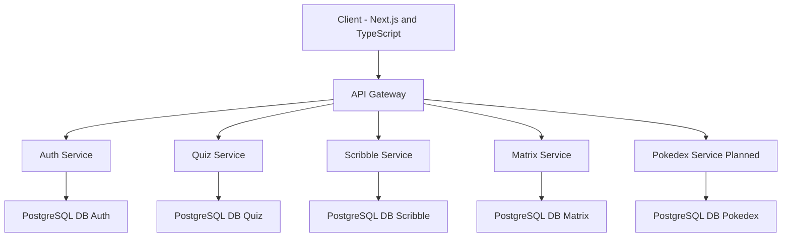

# 🌌 Pokeverse - Backend

Pokeverse is a modular, Pokémon-inspired backend platform supporting a collection of fun, browser-based games—including Pokémon Quiz, Scribble, Matrix, and a Pokedex. Built with a microservices architecture using **Java 21** and **Spring Boot 3.4.2**, it’s designed for flexibility, scalability, and easy extension as new games are added.

---

## 📑 Table of Contents

* [🚀 Features](#-features)
* [🏗️ Architecture](#️-architecture)
* [🗺️ System Diagram](#️-system-diagram)
* [🗂️ Microservices Breakdown](#-microservices-breakdown)
* [🛠️ Tech Stack](#-tech-stack)
* [🔐 Security & Authentication](#-security--authentication)
* [💾 Database Design](#-database-design)
* [📦 Project Structure](#-project-structure)
* [🧰 Setup & Running](#-setup--running)
    * [Prerequisites](#prerequisites)
    * [Example Environment Configuration](#example-environment-configuration)
    * [⚙️ Local Manual Run](#️-local-manual-run)
    * [🐳 Docker Build & Run](#-docker-build--run)
* [📜 API Documentation](#-api-documentation)
* [🗺️ Roadmap](#️-roadmap)
* [🤝 Contributing](#-contributing)
* [👨‍💻 Author](#-author)
* [📝 License](#-license)

---

## 🚀 Features

* ✅ **Microservices-based architecture:** Built for scalability and maintainability.
* ✅ **Multiple Pokémon-themed game backends:** Currently includes Quiz, Scribble, and Matrix, with more to come!
* ✅ **JWT & Google OAuth2 authentication:** Secure user management with refresh tokens.
* ✅ **Service discovery via Eureka:** Dynamic service registration and lookup.
* ✅ **Routing and security via Spring Cloud Gateway:** Centralized request handling and security enforcement.
* ✅ **Separate PostgreSQL databases per service:** Ensures data isolation and facilitates independent scaling.
* ✅ **REST and WebSocket communication:** Flexible interaction between services for diverse game types.
* ✅ **Swagger/OpenAPI documentation:** Interactive API documentation for every microservice.
* ✅ **Dockerfiles for containerized deployment:** Ready for easy deployment in container environments.

---

## 🏗️ Architecture

Pokeverse employs a **Spring Cloud microservices** architecture, where services communicate primarily over **REST** and **WebSockets**. The **Eureka Server** acts as the central service registry, enabling dynamic discovery. The **API Gateway** serves as the unified entry point for all client requests, handling routing, security policies, and Cross-Origin Resource Sharing (CORS). Each game is developed as an independent microservice, complete with its own dedicated database for optimal isolation and flexibility.

---

## 🗺️ System Diagram



**Note:** The Next.js frontend currently supports Auth and Quiz integration. Additional UIs are planned for other games to provide a complete user experience.

---

## 🗂️ Microservices Breakdown

| Service           | Description                                                                 |
| :---------------- | :-------------------------------------------------------------------------- |
| **Eureka Server** | Service registry for dynamic discovery of microservices.                    |
| **API Gateway** | Unified entry point, routes requests, and enforces security policies.       |
| **Auth Service** | Handles user registration, login, JWT issuance, refresh tokens, and Google OAuth2 integration. |
| **Quiz Service** | Manages the Pokémon quiz game logic and persistence.                        |
| **Scribble Service** | Backend for the collaborative Pokémon-themed drawing game.                |
| **Matrix Service** | Implements the logic for the matrix-style puzzle game.                      |
| **Pokedex Service** | Will serve as a comprehensive Pokémon encyclopedia service.     |

---

## 🛠️ Tech Stack

| Layer             | Technology                                   |
| :---------------- | :------------------------------------------- | 
| **Language** | Java 21                                      |
| **Framework** | Spring Boot 3.4.2                            |               
| **Security** | Spring Security, OAuth2 Client, JWT          |               
| **Service Discovery** | Spring Cloud Netflix Eureka              |          
| **API Gateway** | Spring Cloud Gateway                         |            
| **Inter-service Comm.** | REST over HTTP, WebSockets               |        
| **Database** | PostgreSQL (one DB per service)              |               
| **Documentation** | Swagger / OpenAPI                            |          
| **Utilities** | Lombok, Spring Cloud, OpenFeign (optional)   |              
| **Build Tool** | Maven                                        |             
| **Containerization** | Docker (Dockerfiles per service; Compose planned) | 

---

## 🔐 Security & Authentication

Pokeverse implements a robust security model:

* ✅ **Stateless JWT-based authentication:** For secure and scalable API access.
* ✅ **Google OAuth2 login:** Provides convenient and secure third-party authentication.
* ✅ **Refresh tokens:** Enables seamless session renewal without repeated logins.
* ✅ **Enforced at API Gateway and individual services:** Ensures comprehensive security coverage.

⚠️ **Note:** Role-based access control is not yet implemented but is planned for a future release.

---

## 💾 Database Design

**PostgreSQL** is the chosen database for all services, ensuring data integrity and consistency. Each microservice is designed with its **own dedicated database** for maximum isolation and to facilitate independent scaling.

Suggested database names:

* `auth_db`
* `quiz_db`
* `scribble_db`
* `matrix_db`
* `pokedex_db` (future)

---

## 🧰 Setup & Running

### Prerequisites

Before you begin, ensure you have the following installed:

* **Java 21**
* **Maven**
* **PostgreSQL**
* **Docker** (for containerized deployment)

### Example Environment Configuration

Each service typically relies on environment variables for configuration. Here's a common example for a service's `application.properties` or `application.yml`:

```properties
SPRING_DATASOURCE_URL=jdbc:postgresql://localhost:5432/service_db
SPRING_DATASOURCE_USERNAME=postgres
SPRING_DATASOURCE_PASSWORD=your_password
EUREKA_CLIENT_SERVICEURL_DEFAULTZONE=http://localhost:8761/eureka
````

### ⚙️ Local Manual Run

To run the services individually on your local machine:

1.  **Ensure PostgreSQL is running** and all necessary databases (`auth_db`, `quiz_db`, etc.) are created.

2.  **Start Eureka Server:**

    ```bash
    cd API-Gateway/Eureka-server/server
    mvn spring-boot:run
    ```

3.  **Start API Gateway:**

    ```bash
    cd API-Gateway/api-gateway/Gateway
    mvn spring-boot:run
    ```

4.  **Start each microservice** in separate terminal windows:

      * **Authentication Service:**
        ```bash
        cd Authentication/authentication
        mvn spring-boot:run
        ```
      * **PokeDex Service:**
        ```bash
        cd PokeDex/dex
        mvn spring-boot:run
        ```
      * **PokeMatrix Service:**
        ```bash
        cd PokeMatrix/matrix
        mvn spring-boot:run
        ```
      * **PokeQuiz Service:**
        ```bash
        cd PokeQuiz/quiz
        mvn spring-boot:run
        ```
      * **PokeScrible Service:**
        ```bash
        cd PokeScrible/scribble
        mvn spring-boot:run
        ```

### 🐳 Docker Build & Run

To build and run your services using Docker:

1.  **Build each service's Docker image**:

    ```bash
    # Build Eureka Server
    cd API-Gateway/Eureka-server/server
    docker build -t eureka-server .
    cd - # Go back to the previous directory
    
    # Build API Gateway
    cd API-Gateway/api-gateway/Gateway
    docker build -t gateway-server .
    cd - # Go back to the previous directory
    
    # Build Authentication Service
    cd Authentication/authentication
    docker build -t auth-server .
    cd - # Go back to the previous directory
    
    # Build PokeDex Service
    cd PokeDex/dex
    docker build -t pokedex-server .
    cd - # Go back to the previous directory
    
    # Build PokeMatrix Service
    cd PokeMatrix/matrix
    docker build -t matrix-server .
    cd - # Go back to the previous directory
    
    # Build PokeQuiz Service
    cd PokeQuiz/quiz
    docker build -t quiz-server .
    cd - # Go back to the previous directory
    
    # Build PokeScrible Service
    cd PokeScrible/scribble
    docker build -t scribble-server .
    cd - # Go back to the previous directory
    ```
2.  **Run the Docker containers**, ensuring to set the correct environment variables for database connections and Eureka server location. **Remember to change `host.docker.internal` to your Docker host IP if you are not on Docker Desktop.**

    ```bash
    # ✅ Eureka Server
    docker run -d --name eureka-server -p 8761:8761 \
      -e SERVER_PORT=8761 \
      eureka-server

    # ✅ API Gateway
    docker run -d --name api-gateway -p 8080:8080 \
      -e GATEWAY_PORT=8080 \
      -e EUREKA_CLIENT_SERVICEURL_DEFAULTZONE=[http://host.docker.internal:8761/eureka](http://host.docker.internal:8761/eureka) \
      gateway-server

    # ✅ Auth Service
    docker run -d --name auth-service -p 8082:8082 \
      -e SPRING_DATASOURCE_URL=jdbc:postgresql://host.docker.internal:5432/auth_db \
      -e SPRING_DATASOURCE_USERNAME=postgres \
      -e SPRING_DATASOURCE_PASSWORD=your_password \
      -e GOOGLE_CLIENT_ID=your-client-id \
      -e GOOGLE_CLIENT_SECRET=your-client-secret \
      -e JWT_SECRET=myjwtsecret \
      -e ALLOWED_ORIGIN=http://localhost:3000 \
      -e EUREKA_CLIENT_SERVICEURL_DEFAULTZONE=[http://host.docker.internal:8761/eureka](http://host.docker.internal:8761/eureka) \
      auth-server

    # ✅ Quiz Service
    docker run -d --name quiz-service -p 8083:8083 \
      -e SPRING_DATASOURCE_URL=jdbc:postgresql://host.docker.internal:5432/quiz_db \
      -e SPRING_DATASOURCE_USERNAME=postgres \
      -e SPRING_DATASOURCE_PASSWORD=your_password \
      -e EUREKA_CLIENT_SERVICEURL_DEFAULTZONE=[http://host.docker.internal:8761/eureka](http://host.docker.internal:8761/eureka) \
      quiz-server

    # ✅ PokeDex Service
    docker run -d --name pokedex-service -p 8084:8084 \
      -e SPRING_DATASOURCE_URL=jdbc:postgresql://host.docker.internal:5432/pokedex_db \
      -e SPRING_DATASOURCE_USERNAME=postgres \
      -e SPRING_DATASOURCE_PASSWORD=your_password \
      -e EUREKA_CLIENT_SERVICEURL_DEFAULTZONE=[http://host.docker.internal:8761/eureka](http://host.docker.internal:8761/eureka) \
      pokedex-server

    # ✅ Matrix Service
    docker run -d --name matrix-service -p 8085:8085 \
      -e SPRING_DATASOURCE_URL=jdbc:postgresql://host.docker.internal:5432/matrix_db \
      -e SPRING_DATASOURCE_USERNAME=postgres \
      -e SPRING_DATASOURCE_PASSWORD=your_password \
      -e EUREKA_CLIENT_SERVICEURL_DEFAULTZONE=[http://host.docker.internal:8761/eureka](http://host.docker.internal:8761/eureka) \
      matrix-server

    # ✅ Scribble Service
    docker run -d --name scribble-service -p 8086:8086 \
      -e SPRING_DATASOURCE_URL=jdbc:postgresql://host.docker.internal:5432/scribble_db \
      -e SPRING_DATASOURCE_USERNAME=postgres \
      -e SPRING_DATASOURCE_PASSWORD=your_password \
      -e EUREKA_CLIENT_SERVICEURL_DEFAULTZONE=[http://host.docker.internal:8761/eureka](http://host.docker.internal:8761/eureka) \
      scribble-server
    ```

    **Important:** The Docker run commands now correctly reflect **PostgreSQL** database URLs and use `SPRING_DATASOURCE_URL`, `SPRING_DATASOURCE_USERNAME`, and `SPRING_DATASOURCE_PASSWORD` for consistency with Spring Boot's standard environment variables.

-----

## 📜 API Documentation

Interactive **Swagger UI** documentation is available for each deployed service at:

`http://localhost:<port>/swagger-ui/index.html`

Replace `<port>` with the specific port of the service (e.g., `8080` for API Gateway, `8082` for Auth Service, etc.). This documentation automatically describes models, endpoints, and security schemas, making API testing straightforward.

-----

## 🗺️ Roadmap

Here's what's next for Pokeverse:

  * ✅ Eureka Server and API Gateway
  * ✅ Auth Service with JWT and Google OAuth2
  * ✅ Quiz, Scribble, Matrix services
  * ✅ Separate PostgreSQL (or MySQL) databases per service
  * ✅ Dockerfiles per service
  * ✅ Swagger documentation
  * **🟠 Next:**
      * Docker Compose orchestration for easier setup and management.
      * Cloud deployment (AWS, Render, Railway, etc.) for production readiness.
      * Pokedex Service implementation to complete the Pokémon experience.
      * Role-based access control (admin/user) for fine-grained permissions.
      * Centralized configuration server for managing application properties.
      * Enhanced WebSocket-based real-time gameplay.
      * Centralized logging/monitoring (ELK Stack, Grafana) for operational insights.

-----

## 🤝 Contributing

Contributions are highly welcome\! Whether it's adding new features, improving existing ones, or fixing bugs, your help is appreciated.

✨ **Ideas for Contribution:**

  * Add new games as microservices to expand the Pokeverse.
  * Improve authentication with more advanced features like role-based access.
  * Implement Docker Compose orchestration for streamlined local development.
  * Enhance the frontend to integrate with more backend services.

✨ **Steps to Contribute:**

1.  Fork the repository.
2.  Create a new feature branch (`git checkout -b feature/YourFeature`).
3.  Commit your changes (`git commit -m 'Add Your Feature'`).
4.  Push to the branch (`git push origin feature/YourFeature`).
5.  Open a Pull Request.

-----

## 👨‍💻 Author

**Raunak Yadav**

  * [Frontend repo](https://github.com/Raunak7888/PokeverseFrontend.git)

-----

## 📝 License

This project is open-source and available under the **MIT License**. You are free to use, modify, and share it for non-commercial purposes.
